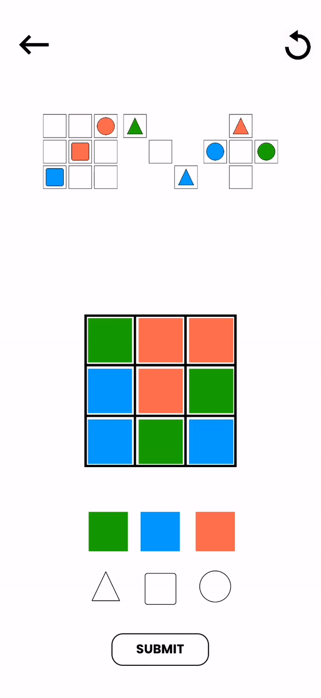

# Shapez
#### *2d Andorid puzzle game*
Inspired by the board game, *Chocolate Fix*, Shapez is a 2d Android puzzle game where the goal is to place shapes in a 3x3 grid according to a set of given hints.

You´ll need to use your solving and deduction abilities to complete each puzzle.


## How was this built?

For this project I challenged myself to learn a new technology from scratch and have a built product in a short period of time. This project was developed in a span of two weeks.

- Godot game engine.
- gdScript (programming language similar to Python).

## What did I learn?
- Godot game engine along with gdScirpt.
- Object Oriented Programming patterns.
- `JSON` file creation and manipulation.
- Reinforced algorithm design skills.
- Reinforced documentation reading abilities.
- Android APK exporting and testing.
- Game publishing in [Itch.io](https://manuelrurda.itch.io/shapez)

## Download
- You can run the project in the Godot engine by downloading this repository and opening `project.godot`.
- Download the game's APK in [Itch.io](https://manuelrurda.itch.io/shapez). Here´s [how to install](https://www.javatpoint.com/how-to-install-apk-on-android#:~:text=Copy%20the%20downloaded%20APK%20file,tap%20on%20it%20to%20install.) an APK to an Android device.


## Gameplay

### *How to play*

<p align="center">

</p>

### 1. *Start*
<p align="center">

</p>

#

### 2. *Select a challenge*
<p align="center">

</p>

#

### 3. *Follow the hints*
<p align="center">

</p>

#

### 4. *Merge outlines and colors to form shapes*
<p align="center">

</p>

#

### 5. *Solve the puzzle*
<p align="center">

</p>

#### *Rush your solution and you might get it wrong*
<p align="center">

</p>

#### *You can delete shapes by placing them out of the grid or clear the board with the reset button*

<p align="center">

</p>
<p align="center">

</p>


## Levels

#### *The game currently has 30 different levels*
<p align="center">

</p>

Each level's solution and hints are stored in a `JSON` file in the following manner:

```
{
    "solution": [18, 15, 20, 28, 10, 24, 14, 12, 21],
    "hints": [
        [0, 0, 20, 0, 10, 0, 14, 0, 0],
        [18, 1, 1, 1, 0, 1, 1, 1, 21],
        [1, 15, 1, 28, 0, 24, 1, 0, 1]
    ]
}
```
Each number represents the value in a dictionary for which the key is a shape sprite. Every time a shape object is created, its `shape_id` property is set to the value that its sprite is mapped to in the dictionary. 

When the submit button is pressed, the `check_solution()` function loops through the grid, comparing each shape's `shape_id` property with the provided solution array declared in the `JSON` file.
 > The combined shapes' `shape_id` properties are the result of multiplying an outline's and a color's `shape_id`.


## Hints

Hard-coding every level would be a tedious and time consuming task. To make the level making easier the functions `generate_level()` and `generate_hints()` take care of creating a level object with its corresponding solution and hints declared in the `JSON`. 

Each level can contain a different number of hints, so, to position each hint properly, I had to design an algorithm that would create, position and scale each hint object depending on the number of hints provided.

```
# get hints form JSON
var num_of_hints = len(globals.levels[level_btn.level_num - 1]["hints"])

var num_of_rows = ceil(num_of_hints/3.0)
var hints_remaining = num_of_hints

# .png pixel size
var hint_size = 776

var scale_size = 0.37-(0.04*num_of_rows)
var new_size = hint_size*scale_size

for i in range(num_of_rows):

    var num_of_cols = hints_remaining - 3*(3-(i+4-num_of_rows))

    for j in range(num_of_cols):

        # Create hint object
        var hint = hint_scene.instance()
        hint.init(globals.levels[level_btn.level_num - 1]["hints"][num_of_hints-hints_remaining])

        # Scale and position each instance
        hint.scale = Vector2(scale_size, scale_size)
        hint.global_position = Vector2(globals.window_width * (j+1)/(num_of_cols + 1) - new_size/2, 
            globals.window_height * (i+1)/(num_of_rows + 4 + (1 * num_of_rows)) - new_size/2 + OS.get_screen_size().y * .1)
        
        # Offset
        hint.global_position += Vector2(-globals.window_width/2, -(globals.window_height/2 + new_size))
        
        level.add_child(hint)
        hints_remaining -= 1
```


#


Manuel Rodriguez Urdapilleta
<p>28/08/2021</p>


